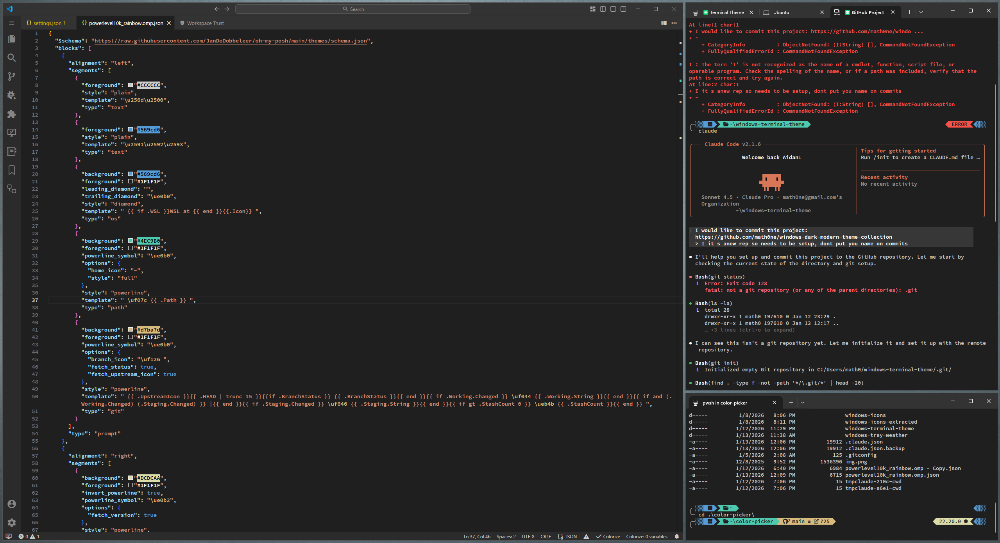

# Windows Dark Modern Theme Collection

A collection of coordinated dark modern themes for Windows Terminal, VS Code, and Oh My Posh.



## Included Themes

### Windows Terminal
- **dark-modern.json** - A sleek dark theme for Windows Terminal

### VS Code
- **windows-dark-moden** - Dark modern theme for Visual Studio Code

### Oh My Posh
- **powerlevel10k_rainbow.omp.json** - Powerlevel10k inspired prompt theme with rainbow colors

## Installation

### Windows Terminal
1. Open Windows Terminal settings
2. Navigate to the color schemes section
3. Add the contents of `windows-terminal/dark-modern.json` to your settings

### VS Code
1. Copy the `vscode/windows-dark-moden` folder to your VS Code extensions directory
2. Reload VS Code
3. Select the theme from the color theme picker

### Oh My Posh
1. Copy `oh-my-posh/powerlevel10k_rainbow.omp.json` to your Oh My Posh themes directory
2. Update your PowerShell profile to use the theme:
   ```powershell
   oh-my-posh init pwsh --config 'path/to/powerlevel10k_rainbow.omp.json' | Invoke-Expression
   ```

## License

Feel free to use and modify these themes for your personal use.
